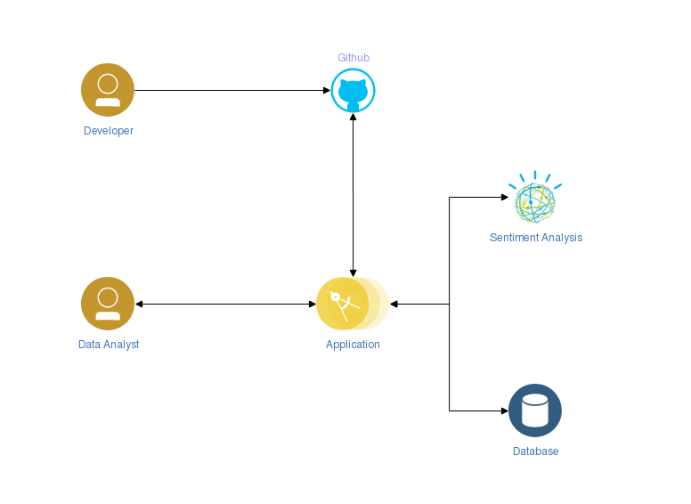

# Project One

## Summary

In this project I will show through several steps how to create a Node.JS application which leverages IBM Cloud Services. 
Application will act as bot which can be enable on one or more Github repositories. Specifically, application (further bot) 
will have following functionality:
 - Develop an application Github Apps paradigm, using [Probot framework](https://probot.github.io/)
 - Add IBM Cloud specific metadata
 - Register IBM Watson Text Analysis service
 - Register for Github issues and pull requests notifications
 - Use tone analysis service API to analyse issue and comments and up-vote or down-vote based on tone
 - Run application locally for development purposes
 - Deploy application in IBM Cloud
 
## Architecture



## Requirements

 - [Node.JS](https://nodejs.org/en/)
 - [IBM Cloud CLI](https://cloud.ibm.com/docs/cli/reference/ibmcloud?topic=cloud-cli-install-ibmcloud-cli)
   * Optionally install IDE plugins:
     1. [Visual Studio Code](https://cloud.ibm.com/docs/cli/reference/ibmcloud?topic=cloud-cli-ibm-dev-tools-for-vscode)
     2. [Jetbrains IDEs](https://cloud.ibm.com/docs/cli/reference/ibmcloud?topic=cloud-cli-ibm-dev-tools-for-jetbrains)
 - [Github account](https://github.com/join?source=header-home)
   * Optionally look at [Github Student Developer Pack](https://education.github.com/pack)


> A GitHub App built with [Probot](https://github.com/probot/probot) that Project One Github App

## Setup

```sh
# Install dependencies
npm install

# Run the bot
npm start
```

## Contributing

If you have suggestions for how project-one could be improved, or want to report a bug, open an issue! We'd love all and any contributions.

For more, check out the [Contributing Guide](CONTRIBUTING.md).

## License

[ISC](LICENSE) © 2020-2024 Egor Margineanu <egor_margineanu@cz.ibm.com/egor.margineanu@kyndryl.com>
